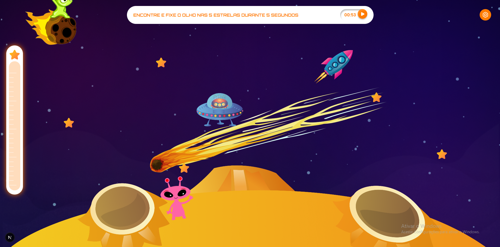
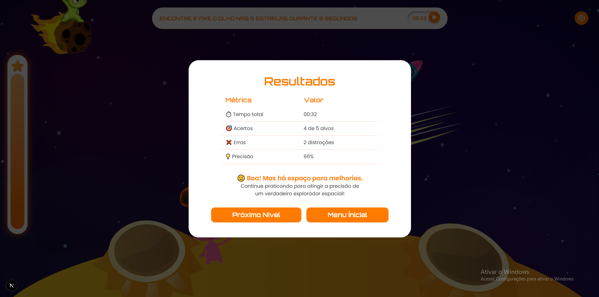

# FocusQuest

FocusQuest é um jogo interativo que combina diversão e desafios para ajudar os jogadores a melhorar sua atenção, foco e precisão. Inspirado no **Teste de Desempenho Contínuo Roosevelt**, o jogo leva os jogadores em uma jornada intergaláctica para explorar planetas e superar distrações.

## 🚀 Funcionalidades

- **Missões Intergalácticas**: Explore 3 planetas com desafios progressivos.
- **Desafios de Foco**: Encontre e fixe o olhar em estrelas enquanto evita distrações.
- **Sistema de Pontuação**: Acompanhe acertos, erros e precisão.
- **Áudio Imersivo**: Sons de fundo para aumentar a imersão.
- **Ranking Global**: Compare seu desempenho com outros jogadores.
- **Configurações Personalizáveis**: Ajuste música e volume durante o jogo.

## 🖼️ Capturas de Tela

### Tela Inicial


### Tela de Jogo


### Tela de Resultados


## 🛠️ Tecnologias Utilizadas

- **Next.js**: Framework para renderização do lado do cliente e servidor.
- **React**: Biblioteca para construção de interfaces de usuário.
- **TypeScript**: Superset do JavaScript para tipagem estática.
- **Tailwind CSS**: Framework para estilização.
- **Framer Motion**: Animações fluidas e interativas.
- **Lucide React**: Ícones modernos e personalizáveis.

## 📂 Estrutura do Projeto

```plaintext
FocusQuest-web/
├── src/
│   ├── app/               # Páginas e rotas do Next.js
│   ├── components/        # Componentes reutilizáveis
│   ├── config/            # Configurações do jogo
│   ├── context/           # Contexto global do jogo
│   ├── hooks/             # Hooks personalizados
│   ├── interface/         # Tipos e interfaces TypeScript
│   ├── utils/             # Funções utilitárias
├── public/                # Arquivos estáticos (imagens, áudio, etc.)
├── .vscode/               # Configurações do editor
├── .gitignore             # Arquivos ignorados pelo Git
├── package.json           # Dependências e scripts do projeto
├── tsconfig.json          # Configurações do TypeScript
└── README.md              # Documentação do projeto
```

## 📦 Instalação
1. Clone o repositório:
     ```bash
    git clone https://github.com/Grupo-Lira/FocusQuest-web.git
    cd focusquest
    ```
2. Instale as dependências:
    ```bash
    npm install
    ```
3. Inicie o servidor de desenvolvimento:
    ```bash
    npm run dev
    ```
4. Acesse o jogo no navegador em `http://localhost:3000`.

## 🕹️ Como Jogar
1. Clique em "Iniciar Jornada" na tela inicial.
2. Inicie no primeiro planeta no menu.
3. Encontre e fixe o olhar nas estrelas enquanto evita distrações.
4. Complete o desafio para desbloquear o próximo nível.

## 📖 Documentação do Código
### Contexto do Jogo
O contexto global do jogo é gerenciado pelo `GameContext`, que fornece estados como `hits`, `errors`, `timeLeft`, e funções para atualizá-los.

### Lógica do Jogo
A lógica principal do jogo está no hook `useGameLogic`, que gerencia as estrelas, nível de progresso e interações do jogador.

### Configurações do Jogo
Os elementos animados e suas configurações estão definidos em `gameConfig`.

## 🛠️ Scripts Disponíveis
`npm run dev`: Inicia o servidor de desenvolvimento.
`npm run build`: Gera a build de produção.
`npm run start`: Inicia o servidor de produção.
`npm run lint`: Executa o linter para verificar erros no código.

## 📄 Licença
Este projeto está licenciado sob a MIT License.
---

Desenvolvido com ❤️ por Amanda, Arthur e Giovana. ```