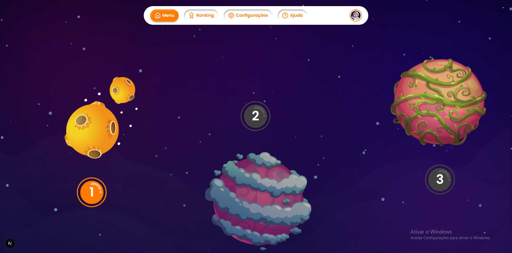
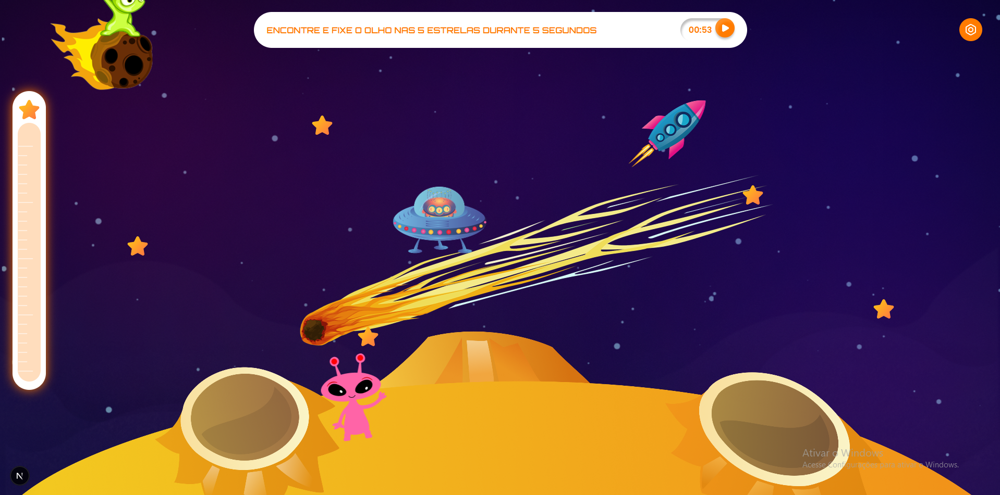
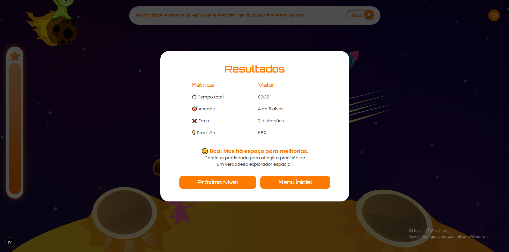

# FocusQuest Frontend

Aplicação Next.js responsável pela interface gamificada do FocusQuest. Ela exibe o fluxo de apresentação, calibração, menu, fases, fichas, configurações e autenticação, consumindo a API do backend e o canal de Socket.IO para sincronizar o andamento dos experimentos.

## Visão Geral

Este frontend concentra a experiência visual do sistema. Ele orquestra a navegação entre as telas do jogo, faz chamadas para o backend, acompanha eventos em tempo real e carrega os assets visuais e sonoros usados nas fases.

## 🚀 Funcionalidades

- **Missões Intergalácticas**: Explore 3 planetas com desafios progressivos.
- **Desafios de Foco**: Encontre e fixe o olhar em estrelas enquanto evita distrações.
- **Sistema de Pontuação**: Acompanhe acertos, erros e precisão.
- **Áudio Imersivo**: Sons de fundo para aumentar a imersão.
- **Ranking Global**: Compare seu desempenho com outros jogadores.
- **Configurações Personalizáveis**: Ajuste música e volume durante o jogo.

## 🖼️ Capturas de Tela

### Tela Inicial



### Tela de Jogo



### Tela de Resultados



## 🛠️ Tecnologias Utilizadas

- **Next.js**: Framework principal da interface.
- **React**: Biblioteca para construção da UI.
- **TypeScript**: Tipagem estática do projeto.
- **Tailwind CSS**: Estilização utilitária.
- **Framer Motion**: Animações e transições.
- **Socket.IO Client**: Comunicação em tempo real com o backend.
- **Lucide React**: Ícones modernos e personalizáveis.

## 📂 Estrutura do Projeto

```plaintext
FocusQuest-web/
├── next.config.ts
├── package.json
├── postcss.config.mjs
├── public/
│   ├── audio/
│   ├── img/
│   └── mediapipe/
├── src/
│   ├── app/
│   │   ├── apresentation/
│   │   ├── calibration/
│   │   ├── fase/
│   │   ├── fichas/
│   │   ├── menu/
│   │   ├── settings/
│   │   ├── signin/
│   │   └── services/
│   ├── components/
│   │   ├── AnimatedElements/
│   │   ├── Calibration/
│   │   └── fase2/
│   ├── config/
│   ├── constants/
│   ├── context/
│   ├── hooks/
│   ├── interface/
│   ├── services/
│   ├── types/
│   └── utils/
├── src/middleware.ts
├── eslint.config.mjs
├── tsconfig.json
└── README.md
```

## 📦 Como Executar

### Projeto Hospedado na GCP:
- Link: https://focusquest-frontend-kxhuw4rwka-uc.a.run.app/

### Pelo monorepo (recomendado)

Se você quer subir frontend, backend, MongoDB e Redis juntos, use o monorepo.

Monorepo: https://github.com/Grupo-Lira/focusquest-monorepo

1. Clone o monorepo com os submodules:

```bash
git clone --recurse-submodules https://github.com/Grupo-Lira/focusquest-monorepo.git
cd focusquest-monorepo
```

2. Suba os serviços com Docker Compose:

```bash
docker compose up --build
```

3. Acesse o frontend em `http://localhost:3000`.

### Pelo frontend separado

Se preferir rodar somente a interface, execute o frontend isoladamente.

1. Clone o repositório:

```bash
git clone https://github.com/Grupo-Lira/FocusQuest-web.git
cd FocusQuest-web
```

2. Instale as dependências:

```bash
npm install
```

3. Crie o arquivo de ambiente local a partir do exemplo e ajuste a URL da API, se necessário:

```bash
cp .env.example .env
```

4. Inicie o servidor de desenvolvimento:

```bash
npm run dev
```

5. Acesse o jogo no navegador em `http://localhost:3000`.

## 🕹️ Como Jogar

1. Selecione a opção **"Criar uma conta"**  
   *(Essa funcionalidade é destinada aos doutores responsáveis pela aplicação do teste).*

2. Preencha os campos:
   - E-mail
   - Senha
   - Confirmar senha

   Em seguida, clique em **"Cadastrar"**.

3. Faça login utilizando os dados cadastrados.

4. No menu principal, selecione a opção **"Calibração"**.  
   *(Sem essa etapa, as fases não funcionarão corretamente).*

5. Após finalizar a calibração, as fases serão liberadas.  
   Inicie pela **Fase 1**.

6. Ao iniciar a Fase 1, será exibida a opção **"Selecionar Paciente"**.

7. Caso o banco de dados ainda não esteja populado, será necessário criar um perfil de paciente.

8. No menu principal:
   - selecione **"Fichas"**
   - clique em **"Criar nova ficha"**
   - preencha os dados solicitados
   - confirme a criação

9. Após criar o paciente:
   - volte para a Fase 1
   - selecione o paciente criado

   O sistema entenderá que aquele paciente será o participante da sessão.
   
## 📖 Documentação do Código

### Contexto do Jogo

O contexto global do jogo é gerenciado pelo `GameContext`, que fornece estados como `hits`, `errors`, `timeLeft`, e funções para atualizá-los.

### Lógica do Jogo

A lógica principal do jogo está no hook `useGameLogic`, que gerencia as estrelas, nível de progresso e interações do jogador.

### Configurações do Jogo

Os elementos animados e suas configurações estão definidos em `gameConfig`.

## 🛠️ Scripts Disponíveis

`npm run dev`: Inicia o servidor de desenvolvimento.
`npm run build`: Gera a build de produção.
`npm run start`: Inicia o servidor de produção.
`npm run lint`: Executa o linter para verificar erros no código.
