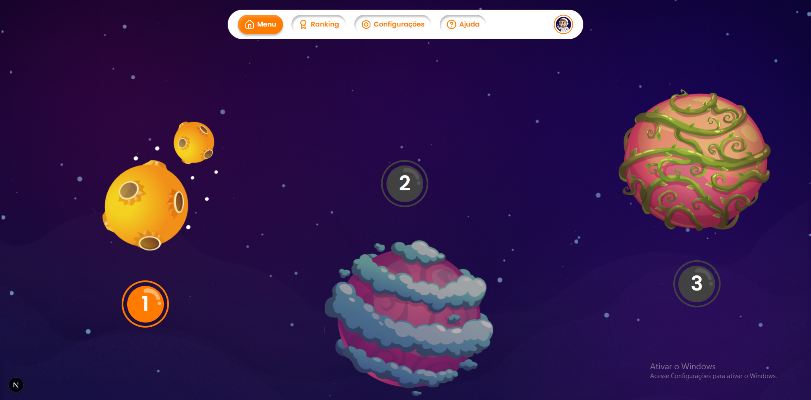
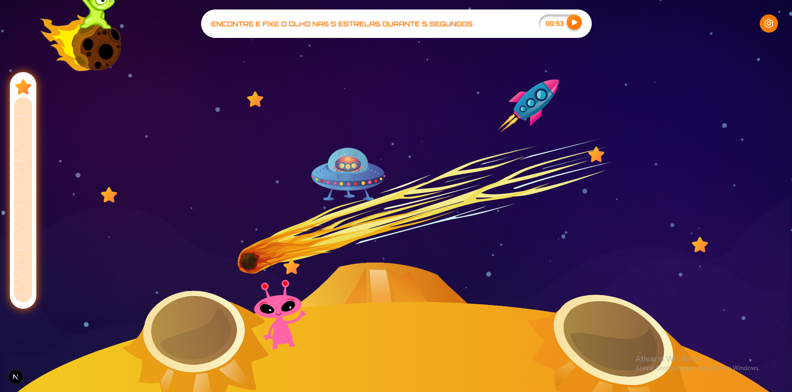
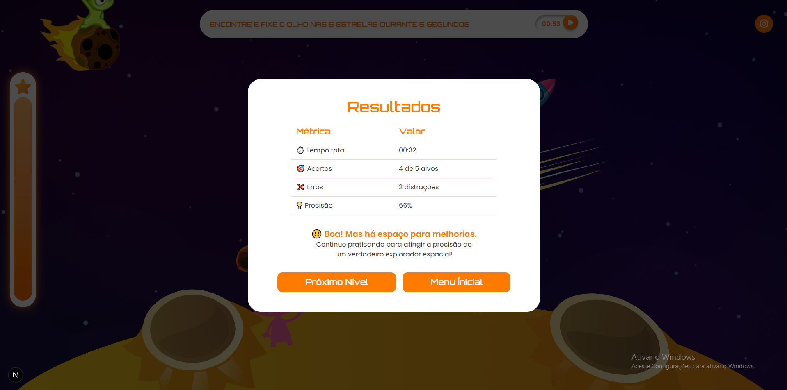

# FocusQuest Frontend

Frontend do FocusQuest, uma aplicação gamificada para aplicação de experimentos de
atenção com suporte a rastreamento ocular. A interface permite autenticar o
profissional, gerenciar pacientes, calibrar o WebGazer, executar três fases do
experimento e consultar métricas e relatórios.

O projeto usa Next.js com App Router e se comunica com o backend por HTTP e
Socket.IO. As fases 1 e 3 enviam coordenadas do olhar; a fase 2 usa respostas por
mouse ou por um controle externo tratado pelo backend.

## Stack principal

- Next.js 15.2.4 e App Router
- React 19
- TypeScript 5
- Tailwind CSS 4
- Socket.IO Client 4
- WebGazer carregado no navegador
- Framer Motion e animações CSS

As versões efetivamente resolvidas estão em `package-lock.json`. Os containers usam
Node.js 20; o `package.json` ainda não declara uma versão em `engines`.

## Funcionalidades implementadas

- Cadastro, login e logout de profissionais.
- Edição do perfil do profissional.
- Cadastro, listagem, edição e exclusão de pacientes.
- Download de relatório PDF por paciente.
- Calibração do rastreamento ocular com nove pontos.
- Fase 1: envio de gaze e acompanhamento de cinco alvos.
- Fase 2: duas rodadas de memória visual com mouse ou controle externo.
- Fase 3: atenção alternada entre uma estrela e um sinalizador.
- Exibição de métricas do experimento e dados comparativos do paciente.
- Música por fase e elementos visuais animados.

Não há implementação funcional de ranking, autenticação social, recuperação de
senha ou busca de pacientes, embora existam elementos visuais relacionados a
algumas dessas funcionalidades.

## Requisitos

- Node.js 20 recomendado, por ser a versão usada nos Dockerfiles.
- npm e acesso a uma instância compatível do backend FocusQuest.
- Navegador com suporte a câmera, `getUserMedia`, WebSocket e armazenamento local.
- HTTPS ou `localhost` para conceder permissão de câmera.

## Configuração

Crie o arquivo local de ambiente a partir do exemplo:

```bash
cp .env.example .env.local
```

Variáveis usadas pela aplicação:

| Variável | Finalidade |
| --- | --- |
| `NEXT_PUBLIC_API_URL` | URL pública do backend, usada pelo Socket.IO e como referência para os rewrites. |
| `BACKEND_INTERNAL_URL` | URL do backend acessível pelo servidor Next.js, especialmente em Docker. |

`NEXT_PUBLIC_API_URL` é exposta ao navegador e não deve conter segredos. Consulte
[DEVELOPMENT.md](DEVELOPMENT.md) para as variáveis declaradas nos exemplos, mas que
não são consumidas pelo código atual.

## Execução local

Instale exatamente as dependências do lockfile:

```bash
npm ci
```

Inicie o servidor de desenvolvimento:

```bash
npm run dev
```

A aplicação ficará disponível, por padrão, em `http://localhost:3000`.

Para gerar e executar a build de produção:

```bash
npm run build
npm run start
```

O repositório também contém `Dockerfile` e `Dockerfile.local`, mas não contém um
arquivo Docker Compose próprio.

## Fluxo básico

```text
login ou cadastro
  -> apresentação
  -> menu
     -> fichas de pacientes
     -> calibração
     -> fase 1
     -> fase 2
     -> fase 3
     -> métricas e relatório do paciente
```

A calibração é necessária para a qualidade do rastreamento, mas o frontend atual
não bloqueia as fases quando ela não foi concluída. As fases 1 e 2 solicitam a
seleção de um paciente; a fase 3 reutiliza o paciente persistido no navegador.

## Estrutura resumida

```text
src/app/          rotas, layout global e telas das fases
src/components/   componentes compartilhados e componentes de domínio
src/context/      estado global de jogo, áudio, paciente, toasts e Eye Tracking
src/hooks/        Socket.IO e comportamentos auxiliares das fases
src/services/     autenticação, usuários, pacientes e relatórios
src/constants/    passos de tutorial, estrelas e tipos de controle
src/config/       configuração dos elementos animados
src/types/        contratos TypeScript de HTTP e métricas
public/audio/     trilhas das três fases
public/img/       imagens, ícones e screenshots
public/mediapipe/ cópia local do Face Mesh; sem consumidor confirmado no código
```

## Estado das validações

Ainda não foi identificada infraestrutura de testes automatizados.

O script `npm run lint` existe, mas a configuração ESLint atual contém um erro de
sintaxe e precisa ser corrigida antes que o comando funcione. O typecheck também
possui erros conhecidos. Veja a lista e os comandos de diagnóstico em
[DEVELOPMENT.md](DEVELOPMENT.md).

## Documentação

- [ARCHITECTURE.md](ARCHITECTURE.md): rotas, providers, estado e integrações.
- [docs/EYE_TRACKING.md](docs/EYE_TRACKING.md): WebGazer, calibração, câmera e ciclo de vida.
- [docs/SOCKET_IO.md](docs/SOCKET_IO.md): conexão e eventos das três fases.
- [DEVELOPMENT.md](DEVELOPMENT.md): ambiente, comandos, Docker e troubleshooting.
- [AGENTS.md](AGENTS.md): regras operacionais para agentes de código.

## Capturas de tela

| Início | Jogo | Resultados |
| --- | --- | --- |
|  |  |  |
